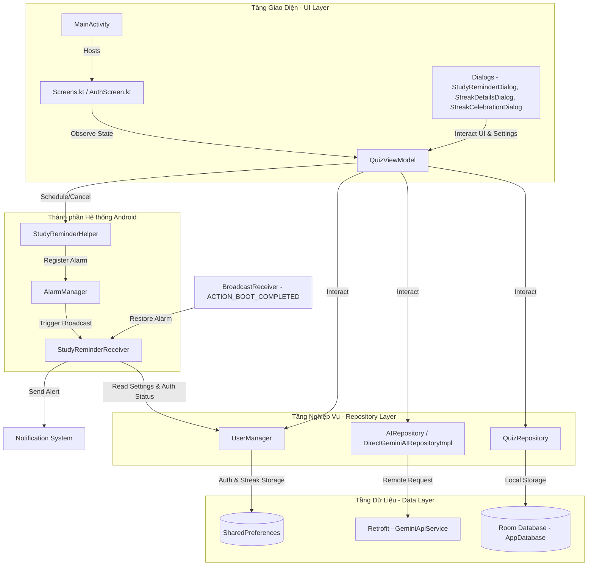
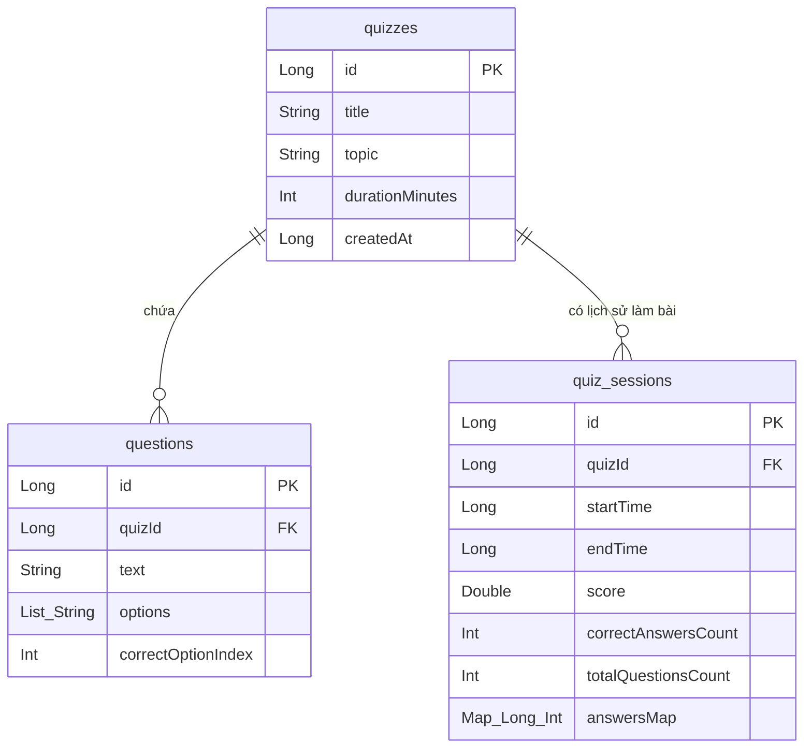

# Kiến trúc Dự án: QuizAI

Tài liệu này mô tả chi tiết kiến trúc hệ thống, công nghệ sử dụng, cấu trúc dữ liệu và các luồng xử lý chính trong ứng dụng Android **QuizAI**.

---

## 1. Tổng quan Ứng dụng
**QuizAI** là ứng dụng Android hỗ trợ ôn luyện thi trắc nghiệm thông minh, tích hợp trí tuệ nhân tạo (Generative AI). Ứng dụng cho phép người dùng tự động quét đề thi từ sách vở thông qua camera hoặc tạo đề nhanh chóng từ các chủ đề mong muốn thông qua việc trò chuyện với trợ lý AI. Đồng thời cung cấp tính năng phân tích kết quả bài thi và giải thích chi tiết các câu trả lời sai bằng AI Sư Phụ.

---

## 2. Công nghệ Sử dụng (Tech Stack)

Ứng dụng được xây dựng trên nền tảng công nghệ Android hiện đại:

*   **Ngôn ngữ lập trình:** Kotlin
*   **UI Framework:** Jetpack Compose (Declarative UI) đem lại giao diện mượt mà và trực quan.
*   **Kiến trúc ứng dụng:** MVVM (Model-View-ViewModel) kết hợp với mô hình Dependency Injection (DI) thủ công gọn nhẹ (`AppContainer`).
*   **Cơ sở dữ liệu cục bộ (Local DB):** Room Database với Type Converters dùng Moshi để lưu trữ danh sách đề, câu hỏi và lịch sử làm bài.
*   **Lưu trữ cấu hình / Auth & Streak/Reminder:** SharedPreferences dùng cho `UserManager` để lưu session tài khoản, trạng thái Streak (chuỗi ngày học), số lượt Đóng băng chuỗi, và lịch nhắc học tập.
*   **Kết nối Mạng & API:**
    *   **Retrofit 2 & OkHttp 3:** Thực hiện các yêu cầu HTTP để kết nối trực tiếp với API của Gemini.
    *   **HttpLoggingInterceptor:** Log chi tiết dữ liệu API gửi và nhận để hỗ trợ gỡ lỗi.
*   **Xử lý bất đồng bộ:** Kotlin Coroutines & Flow giúp quản lý luồng dữ liệu thời gian thực và các tác vụ nền hiệu quả.
*   **Tích hợp Trí tuệ nhân tạo (AI):**
    *   Sử dụng trực tiếp Google Gemini API (model `gemini-3.1-flash-lite` hoặc `gemini-1.5-flash-8b`) để tạo đề thi có cấu trúc từ hình ảnh hoặc đoạn chat.
    *   Cung cấp tính năng gia sư ảo để giải thích chi tiết đáp án câu hỏi.
*   **Hệ thống Báo thức & Thông báo nền:**
    *   **AlarmManager:** Lên lịch báo nhắc học tập hàng ngày một cách chính xác.
    *   **BroadcastReceiver (StudyReminderReceiver):** Lắng nghe tín hiệu báo nhắc và hiển thị thông báo đẩy, đồng thời tự khôi phục lịch nhắc khi khởi động lại thiết bị (`BOOT_COMPLETED`).
    *   **NotificationManager:** Quản lý và phát các thông báo đẩy nhắc học.
*   **Tuần tự hóa dữ liệu (Serialization):**
    *   **Moshi:** Chuyển đổi JSON dạng cấu trúc dữ liệu Local & Room.
    *   **Kotlinx Serialization:** Định nghĩa định dạng dữ liệu cho Gemini API request/response.
*   **Thư viện bổ trợ:**
    *   **Accompanist Permissions:** Quản lý quyền truy cập Camera và quyền thông báo đẩy `POST_NOTIFICATIONS` (trên Android 13+) động trên Jetpack Compose.
    *   **Secrets Gradle Plugin:** Bảo mật `GEMINI_API_KEY` thông qua file cấu hình `.env` cục bộ, tránh lộ mã khóa API trên Git.

---

## 3. Kiến trúc Hệ thống (Architecture Overview)

Dự án áp dụng mô hình kiến trúc phân lớp sạch sẽ, tách biệt rõ ràng giữa logic giao diện, logic nghiệp vụ, dữ liệu và các dịch vụ nền hệ thống:



### Chi tiết các lớp chính:
1.  **`QuizApplication`**: Điểm khởi chạy ứng dụng, thiết lập và giữ thực thể của `AppContainer` cho toàn bộ vòng đời ứng dụng.
2.  **`AppContainer` & `AppContainerImpl`**: Đóng vai trò làm bộ chứa Dependency Injection thủ công, khởi tạo các dịch vụ cơ sở dữ liệu (`AppDatabase`), quản lý người dùng (`UserManager`), các kho dữ liệu (`QuizRepository`, `AIRepository`) và chia sẻ chúng cho ViewModel.
3.  **`QuizViewModel`**: Quản lý toàn bộ trạng thái UI (State), luồng làm bài thi (hẹn giờ, chọn đáp án), đăng nhập/đăng ký, cấu hình nhắc nhở, cập nhật chuỗi Streak học tập và kích hoạt các yêu cầu tạo đề/giải thích qua AI.
4.  **`UserManager`**: Chịu trách nhiệm lưu trữ cục bộ các tùy chọn của người dùng trong SharedPreferences. Lớp này nắm giữ các hàm quản lý tài khoản (Đăng nhập/Đăng ký), ghi nhận danh sách các ngày học tích cực (`streak_active_dates_<user>`), kiểm tra/trừ lượt Đóng băng chuỗi (`Streak Freezes`) để bảo toàn chuỗi ngày học liên tục khi người dùng quên làm bài, và cấu hình lịch báo nhắc học tập.
5.  **`StudyReminderHelper` & `StudyReminderReceiver`**: Lớp Helper điều khiển báo thức hệ thống `AlarmManager` để bật/tắt nhắc học theo thời gian mong muốn. Lớp Receiver là một `BroadcastReceiver` xử lý tín hiệu báo thức nền để kiểm tra logic (tài khoản đã đăng nhập, ngày hiện tại nằm trong lịch nhắc), gửi thông báo đẩy đến thanh trạng thái của Android và đăng ký lịch nhắc tiếp theo cho ngày mai. Ngoài ra, lớp này còn giúp nạp lại lịch nhắc sau khi thiết bị khởi động lại.

---

## 4. Thiết kế Cơ sở Dữ liệu Cục bộ (Room Database)

Ứng dụng lưu dữ liệu ngoại tuyến gồm đề thi, câu hỏi và lịch sử làm bài thông qua 3 bảng chính:



*   **`QuizEntity`** (Bảng `quizzes`): Lưu thông tin cấu hình chung của đề thi (Tiêu đề, Chủ đề, Thời gian thi).
*   **`QuestionEntity`** (Bảng `questions`): Lưu danh sách câu hỏi trắc nghiệm thuộc về một đề thi nhất định (`quizId`). Sử dụng `RoomConverters` chuyển đổi danh sách các lựa chọn (`List<String>`) sang chuỗi JSON khi lưu vào DB.
*   **`QuizSessionEntity`** (Bảng `quiz_sessions`): Lưu vết lịch sử thi của người dùng bao gồm điểm số %, số câu đúng, thời gian làm và ánh xạ các đáp án đã chọn (`answersMap: Map<Long, Int>`).

---

## 5. Tích hợp Trí tuệ nhân tạo (Gemini AI API)

Ứng dụng giao tiếp với Gemini API thông qua Retrofit Client bằng cách tạo cấu trúc request có cấu hình định dạng phản hồi phù hợp.

### A. Luồng tạo đề thi tự động
Khi quét ảnh (`generateQuizFromImage`) hoặc gửi prompt chat (`generateQuizFromText`):
1.  Ứng dụng gửi một prompt chi tiết kèm theo ảnh (đã được nén thành dạng Base64) hoặc nội dung chat tới mô hình Gemini.
2.  Prompt yêu cầu cụ thể định dạng trả về bắt buộc phải là một đối tượng JSON khớp chính xác với schema:
    ```json
    {
      "title": "Tên đề thi trắc nghiệm ngắn gọn",
      "topic": "Chủ đề tổng quát (ví dụ: Vật lý, Tiếng Nhật N3...)",
      "questions": [
        {
          "text": "Nội dung câu hỏi trắc nghiệm",
          "options": ["Lựa chọn A", "Lựa chọn B", "Lựa chọn C", "Lựa chọn D"],
          "correctOptionIndex": 0
        }
      ]
    }
    ```
3.  Kết quả trả về được làm sạch (loại bỏ các thẻ markdown ```json) và phân tích bằng thư viện **Kotlinx Serialization** thành lớp `GeneratedQuizJson`.
4.  Lớp dữ liệu này tiếp tục được chuyển đổi thành `QuizEntity` và danh sách `QuestionEntity` để lưu xuống cơ sở dữ liệu Room Database.

### B. Luồng giải thích đáp án trắc nghiệm
Khi người dùng bấm **"Hỏi AI Sư Phụ giải thích"**:
1.  Gửi yêu cầu chứa: *Nội dung câu hỏi, Các phương án lựa chọn, Đáp án đúng thực tế, và Đáp án mà người dùng đã chọn*.
2.  Gemini nhận vai trò là một Gia sư giáo dục ảo để phân tích tại sao lựa chọn của người dùng chưa chính xác, lý do đáp án đúng là gì bằng tiếng Việt, phản hồi dưới định dạng Markdown hiển thị trực tiếp lên màn hình kết quả.

---

## 6. Các Màn hình & Luồng Giao diện (Navigation & UI Flow)

Ứng dụng thiết kế theo phong cách giao diện tối giản hiện đại (High Density Indigo Brand) với màu chủ đạo là Tím (`PrimaryPurple`) và các trạng thái thẻ rõ ràng.

### Danh sách màn hình & Dialog chính:
*   **`AuthScreen`**: Giao diện Đăng nhập và Đăng ký.
*   **`HomeScreen`**: Trang chủ hiển thị tổng quan, danh sách đề thi hiện có, và lịch sử làm bài thi.
*   **`CameraScanScreen`**: Màn hình Camera Preview sử dụng `CameraX` và `AndroidView` tích hợp thêm nút chọn ảnh từ thư viện để gửi ảnh tài liệu cho AI phân tích.
*   **`ManageQuestionsScreen`**: Giao diện cho phép xem danh sách câu hỏi trong một đề, thêm câu hỏi thủ công, hoặc chỉnh sửa/xóa câu hỏi.
*   **`QuizPlayScreen`**: Giao diện làm bài thi trắc nghiệm, hiển thị đếm ngược thời gian thi thực tế, tự động nộp bài khi hết giờ.
*   **`QuizReviewScreen`**: Giao diện xem lại chi tiết bài làm sau khi thi, so sánh lựa chọn của bản thân với đáp án đúng và nhận lời giải thích từ Gemini AI.
*   **`StudyReminderDialog`**: Dialog cấu hình lịch nhắc học tập hàng ngày với các trường chọn giờ/phút và ngày nhắc học trong tuần trực quan.
*   **`StreakDetailsDialog`**: Dialog xem chi tiết chuỗi ngày học qua một Lịch dạng ô lưới lục giác kết nối động và xem/refill các lượt Đóng băng chuỗi.
*   **`StreakCelebrationDialog`**: Dialog popup chúc mừng ngọn lửa Streak xuất hiện sinh động sau khi kết thúc bài hoặc khi khởi chạy ứng dụng.

---

## 7. Cấu trúc Thư mục Dự án

Dưới đây là sơ đồ thư mục mã nguồn chính của ứng dụng:

```text
app/src/main/
├── AndroidManifest.xml              # Tệp cấu hình ứng dụng Android (Permissions, Receivers, Activities...)
├── java/com/example/
│   ├── QuizApplication.kt           # Khởi tạo Application & AppContainer
│   ├── DependencyContainer.kt       # Bộ quản lý DI thủ công (AppContainer)
│   ├── MainActivity.kt              # Điểm đầu vào chính, quản lý luồng điều hướng màn hình
│   ├── data/
│   │   ├── local/
│   │   │   ├── AppDatabase.kt       # Khởi tạo Room Database
│   │   │   ├── Dao.kt               # Chứa các interface truy vấn Database (QuizDao, QuizSessionDao)
│   │   │   ├── Entities.kt          # Room Entities (QuizEntity, QuestionEntity, QuizSessionEntity...)
│   │   │   └── UserManager.kt       # Quản lý Đăng nhập/Đăng ký, Streak, Freezes & Reminders qua SharedPreferences
│   │   ├── remote/
│   │   │   ├── GeminiApiService.kt  # Định nghĩa API Call Retrofit tới Gemini
│   │   │   ├── GeminiModels.kt      # DTOs cho API Request và Response của Gemini
│   │   │   ├── GeminiQuizResponse.kt# Khớp cấu trúc JSON phản hồi từ AI
│   │   │   └── RetrofitClient.kt    # Khởi tạo Retrofit & OkHttpClient cấu hình timeout
│   │   └── repository/
│   │       ├── AIRepository.kt      # Repository gửi prompt, nhận phân tích từ AI
│   │       └── QuizRepository.kt    # Repository quản lý dữ liệu Database cục bộ
│   ├── reminder/
│   │   ├── StudyReminderHelper.kt   # Helper lên lịch và hủy báo thức qua AlarmManager
│   │   └── StudyReminderReceiver.kt # BroadcastReceiver xử lý tín hiệu báo thức và hiển thị Notification
│   └── ui/
│       ├── QuizViewModel.kt         # ViewModel quản lý trạng thái nghiệp vụ và dữ liệu giao diện
│       ├── screens/
│       │   ├── AuthScreen.kt        # Màn hình đăng nhập/đăng ký người dùng
│       │   ├── Screens.kt           # Các màn hình chính (Home, Camera, Play, Review, Manage)
│       │   ├── ReminderDialog.kt    # Dialog cấu hình thời gian nhắc nhở học tập hàng ngày
│       │   └── StreakDialogs.kt     # Các Dialog hiển thị chi tiết chuỗi học và Chúc mừng Streak
│       └── theme/
│           ├── Color.kt             # Bảng màu Indigo, CorrectGreen, ErrorRed...
│           ├── Theme.kt             # Cấu hình MyApplicationTheme cho giao diện Sáng/Tối
│           └── Type.kt              # Định nghĩa Font và Kích thước chữ (Typography)
└── res/
    ├── values/
    │   └── strings.xml              # File định nghĩa chuỗi tài nguyên (App Name: QuizAI)
    └── xml/                         # Cấu hình backup dữ liệu
```
