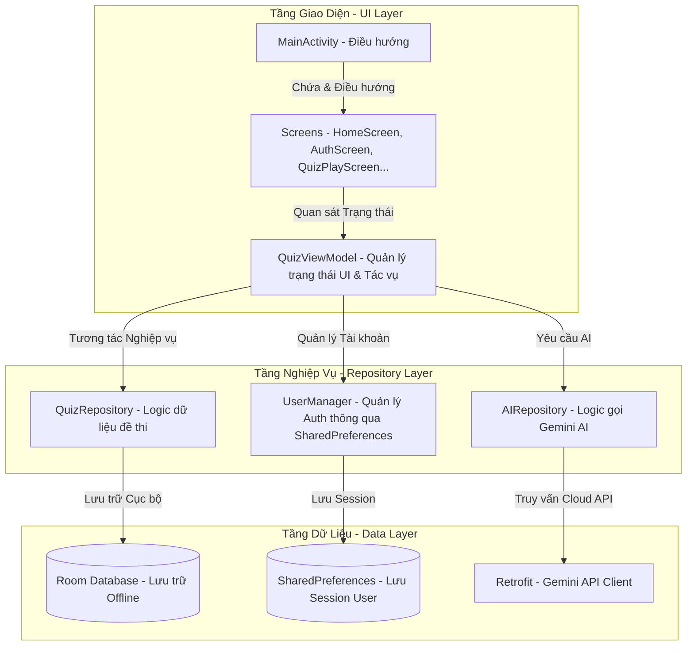
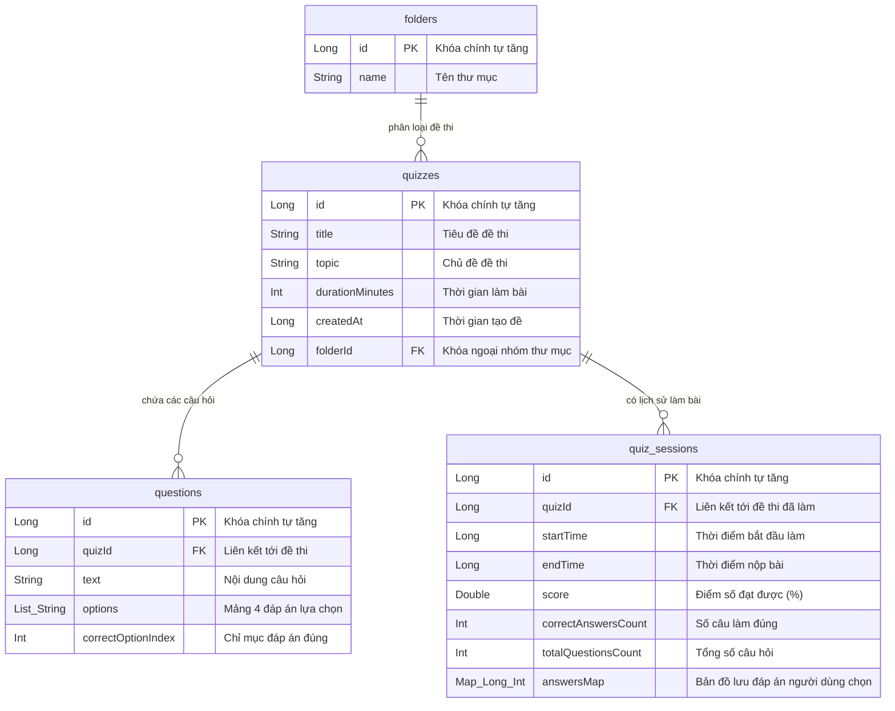

# BÁO CÁO PHÂN TÍCH VÀ THIẾT KẾ HỆ THỐNG
## DỰ ÁN: ỨNG DỤNG ÔN LUYỆN TRẮC NGHIỆM THÔNG MINH QUIZAI

---

## 1. Giới thiệu Tổng quan Dự án

**QuizAI** là ứng dụng di động trên nền tảng Android được thiết kế nhằm mục đích hỗ trợ học sinh, sinh viên và người ôn thi tối ưu hóa quá trình học tập. Điểm đặc biệt của ứng dụng là tích hợp sâu công nghệ Trí tuệ nhân tạo (Generative AI) để tự động hóa quá trình soạn đề thi trắc nghiệm và đóng vai trò làm một **"Sư phụ AI"** hỗ trợ giải thích chi tiết đáp án mọi lúc mọi nơi.

### Các bài toán giải quyết:
- **Tự động hóa soạn đề:** Tiết kiệm thời gian tự soạn đề bằng cách chụp tài liệu học tập hoặc ra lệnh dạng văn bản chat để AI tự tạo đề thi có đầy đủ câu hỏi, lựa chọn và đáp án đúng.
- **Tự học thông minh:** Khi làm sai, người dùng không chỉ biết đáp án đúng mà còn nhận được phân tích sư phạm chi tiết giải thích lý do tại sao phương án mình chọn chưa chính xác và cách tư duy đúng để giải quyết câu hỏi đó.
- **Tiện lợi ngoại tuyến:** Lưu trữ toàn bộ đề thi và lịch sử làm bài offline trên thiết bị để người dùng học tập mọi lúc không phụ thuộc mạng internet.

---

## 2. Các Tính năng Chính của Ứng dụng

1.  **Tạo Đề Thi Tự Động Bằng AI (AI Quiz Generation):**
    *   **Quét ảnh đề thi (Camera Scan):** Chụp trực tiếp trang sách bài tập, đề thi giấy bằng camera hoặc chọn ảnh từ thư viện để AI quét, nhận diện chữ viết và thiết kế thành đề thi trắc nghiệm trên app.
    *   **Tạo đề bằng Chat (AI Chat Prompt):** Nhập chủ đề hoặc yêu cầu mong muốn (ví dụ: *"Tạo đề thi tiếng Anh lớp 12 về thì Hiện tại hoàn thành"*) để AI thiết kế đề thi tương thích ngay lập tức.
2.  **Làm Bài Thi Trắc Nghiệm Thời Gian Thực (Quiz Play & Practice):**
    *   Hỗ trợ chế độ thi tính giờ (countdown timer) và chế độ luyện tập tự do.
    *   Tự động thu bài khi hết giờ, hiển thị kết quả trực quan ngay sau khi hoàn thành.
3.  **Học Tập Cùng "Sư Phụ AI" (AI Explanation & Tutoring):**
    *   Bấm nút gửi yêu cầu giải thích đối với từng câu hỏi.
    *   Nhận giải nghĩa chi tiết định dạng Markdown từ **Sư phụ AI** phân tích cụ thể từng đáp án.
4.  **Quản Lý Đề Thi & Thư Mục Học Tập (Quiz & Folder Management):**
    *   Phân loại đề thi theo từng thư mục học tập riêng biệt.
    *   Chỉnh sửa câu hỏi, thêm câu hỏi thủ công hoặc xóa đề thi dễ dàng.
5.  **Bảng Lịch Sử & Thống Kê Học Tập (History & Analytics Dashboard):**
    *   Lưu trữ kết quả tất cả các phiên làm bài.
    *   Vẽ biểu đồ tiến trình học tập, tính toán điểm số trung bình và đếm chuỗi ngày học liên tục (Streak) để duy trì động lực.

---

## 3. Công nghệ Sử dụng (Tech Stack)

Ứng dụng được phát triển bằng các công nghệ Android hiện đại và tối ưu nhất:
*   **Ngôn ngữ lập trình:** Kotlin (Phiên bản mới nhất).
*   **UI Framework:** Jetpack Compose (Declarative UI) giúp xây dựng giao diện động mượt mà và trực quan.
*   **Kiến trúc:** Model-View-ViewModel (MVVM) giúp phân tách rõ ràng trách nhiệm của các lớp.
*   **Dependency Injection (DI):** Khởi tạo và phân phối phụ thuộc thủ công thông qua `AppContainer` giúp tối ưu dung lượng ứng dụng và tốc độ khởi động.
*   **Cơ sở dữ liệu:** Room Database (SQLite ORM) tích hợp Type Converters lưu cấu hình JSON.
*   **Kết nối mạng & API:** Retrofit 2 & OkHttp 3 để kết nối trực tiếp đến API của Google Gemini.
*   **Xử lý bất đồng bộ:** Kotlin Coroutines & Flow quản lý dữ liệu bất đồng bộ thời gian thực.
*   **Trí tuệ nhân tạo (AI Engine):** Kết nối trực tiếp Google Gemini API (model `gemini-3.1-flash-lite` hoặc `gemini-1.5-flash-8b`) để sinh đề thi định dạng JSON và phân tích đáp án.

---

## 4. Kiến trúc Hệ thống (Architecture Overview)

Dự án áp dụng mô hình kiến trúc phân lớp sạch sẽ, tách biệt rõ ràng giữa logic giao diện, logic nghiệp vụ và tầng lưu trữ dữ liệu:



### Các lớp cốt lõi trong mã nguồn:
1.  **`AppContainer` (Dependency Injection):** Chịu trách nhiệm khởi tạo duy nhất một lần các đối tượng dùng chung như `AppDatabase`, `RetrofitClient`, `QuizRepository`, `AIRepository` và cung cấp chúng cho ViewModel Factory, tránh rò rỉ bộ nhớ.
2.  **`QuizViewModel`:** Đóng vai trò là "bộ não" điều khiển giao diện. Nó tiếp nhận sự kiện từ người dùng (nhấp chọn, gửi prompt, chụp ảnh), giao tiếp với tầng Repository để lấy dữ liệu, cập nhật State định dạng Flow và tự động vẽ lại giao diện tương ứng trên Compose.

---

## 5. Thiết kế Cơ sở Dữ liệu Cục bộ (Room Database)

Hệ thống lưu trữ cơ sở dữ liệu trên thiết bị bao gồm 3 thực thể chính quan hệ chặt chẽ với nhau:



*   **Type Converters:** Vì Room Database không hỗ trợ trực tiếp kiểu dữ liệu mảng phức tạp như `List<String>` hay cấu trúc bản đồ `Map<Long, Int>`, dự án tích hợp lớp `RoomConverters` sử dụng thư viện **Moshi Json** để tự động chuyển các mảng này thành chuỗi String JSON khi lưu vào DB và giải tuần tự hóa ngược lại khi truy vấn lên.

---

## 6. Cơ chế Tích hợp Trí tuệ Nhân tạo (Gemini AI API)

Điểm nhấn kỹ thuật cốt lõi của **QuizAI** là cách giao tiếp với Google Gemini API một cách bảo mật, tối ưu và kiểm soát định dạng dữ liệu trả về chặt chẽ.

### A. Quy trình Tạo Đề Thi tự động với định dạng JSON tĩnh (Structured JSON Response)
Để đảm bảo AI luôn trả về dữ liệu có cấu trúc ổn định mà ứng dụng Android có thể đọc và phân tích thành đối tượng Kotlin (tránh lỗi định dạng text tự do thông thường của Chatbot), ứng dụng thực hiện các bước sau:
1.  **Thiết kế System Prompt chi tiết:** Ép mô hình đóng vai trò một chuyên gia soạn đề thi trắc nghiệm.
2.  **Định nghĩa JSON Schema nghiêm ngặt:** Chỉ định rõ kiểu dữ liệu của từng trường (`title` dạng String, `questions` dạng Array các Object gồm `text`, `options` và `correctOptionIndex`).
3.  **Làm sạch dữ liệu (Clean Response Code):** Nhận kết quả từ Gemini API, giải quyết các ký tự thừa hoặc định dạng Markdown ```json trước khi đưa vào thư viện **Kotlinx Serialization** để chuyển đổi (Deserialize) thành lớp đối tượng `GeneratedQuizJson`.
4.  **Transaction Database:** Lưu thông tin đề thi và danh sách câu hỏi đồng thời vào Room DB dưới dạng một tác vụ đơn lẻ để bảo toàn tính toàn vẹn dữ liệu.

### B. Logic Giải thích học tập của "Sư Phụ AI"
Khi người dùng yêu cầu giải thích một câu hỏi, ứng dụng sẽ gửi lên API một prompt động có cấu trúc:
*   *Câu hỏi:* `[Nội dung câu hỏi]`
*   *Các đáp án:* `[Đáp án A, B, C, D]`
*   *Đáp án chính xác:* `[Đáp án đúng]`
*   *Đáp án người dùng chọn:* `[Lựa chọn của người dùng]`
*   *Yêu cầu:* *"Hãy đóng vai trò một Sư phụ AI dạy học. Hãy phân tích ngắn gọn, súc tích bằng tiếng Việt vì sao lựa chọn của người dùng là chưa đúng (nếu sai), giải thích tại sao đáp án chính xác là đúng. Phản hồi dưới dạng Markdown trình bày sạch đẹp."*
Kết quả trả về được hiển thị trực tiếp lên UI thông qua trình dựng định dạng Rich Text Markdown.

---

## 7. Các Màn hình hiển thị & Luồng Trải nghiệm Người dùng (UI/UX)

Giao diện ứng dụng được thiết kế theo phong cách hiện đại với tông màu Indigo (Tím đậm) tạo cảm giác công nghệ cao nhưng vẫn dễ tiếp cận cho học sinh:

*   **`AuthScreen` (Đăng nhập):** Sử dụng các ô nhập liệu bo góc mềm mại, hỗ trợ đầy đủ kiểm tra định dạng dữ liệu (validation) đầu vào.
*   **`HomeScreen` (Trang chủ):**
    *   **Header QuizAI**: Kèm theo một Badge gradient `AI` lấp lánh khẳng định thương hiệu ứng dụng tích hợp trí tuệ nhân tạo.
    *   **Thẻ trạng thái Trợ Lý AI**: Hiển thị trạng thái hoạt động trực tuyến ("Active 24/7" với chấm xanh lá cây nhấp nháy), mang lại cảm giác sinh động, luôn có người hỗ trợ học tập sẵn sàng.
    *   **Phân mục đề thi & Thư mục**: Thiết kế dạng danh sách cuộn nhanh, hỗ trợ kéo thả lọc theo thư mục hoặc nhấp chọn để bắt đầu làm bài.
*   **`CameraScanScreen` (Quét ảnh):** Tích hợp CameraX, hiển thị khung căn chỉnh tài liệu tối ưu giúp người dùng chụp ảnh đề thi rõ ràng nhất.
*   **`QuizPlayScreen` (Làm bài):** Hiển thị thanh tiến trình làm bài, đồng hồ đếm ngược và bảng chuyển câu hỏi nhanh. Tích hợp nút **"Hỏi AI Sư Phụ giải thích"** để xem lời giải ngay lập tức nếu chọn chế độ luyện tập tự do.
*   **`QuizReviewScreen` (Xem lại):** Đánh dấu màu Xanh lá cho câu trả lời đúng, Đỏ cho câu trả lời sai. Hiển thị hộp thoại chứa nội dung giải thích chi tiết định dạng Markdown từ **Sư phụ AI**.

---

## 8. Hướng dẫn Triển khai & Cài đặt Dự án

Để chạy thử nghiệm hoặc phát triển ứng dụng này, thực hiện các bước sau:

1.  **Yêu cầu môi trường:**
    *   Android Studio Ladybug trở lên.
    *   JDK 17 hoặc JDK 21.
    *   Android SDK 34 trở lên.
2.  **Cấu hình API Key:**
    *   Tạo tài khoản Google AI Studio và sinh mã khóa API (`Gemini API Key`).
    *   Tạo file `.env` ở thư mục gốc của dự án Android và dán cấu hình khóa bảo mật vào:
        ```env
        GEMINI_API_KEY=khóa_api_gemini_của_bạn_ở_đây
        ```
    *   Hệ thống build của Gradle (qua thư viện `Secrets Gradle Plugin`) sẽ tự động đọc file này và nhúng an toàn vào mã Java/Kotlin dưới biến cấu hình `BuildConfig.GEMINI_API_KEY` khi biên dịch.
3.  **Build và Chạy:**
    *   Đồng bộ Gradle (`Sync Project with Gradle Files`).
    *   Kết nối thiết bị giả lập hoặc máy thật Android qua chế độ Debug USB.
    *   Bấm **Run 'app'** để cài đặt ứng dụng.
